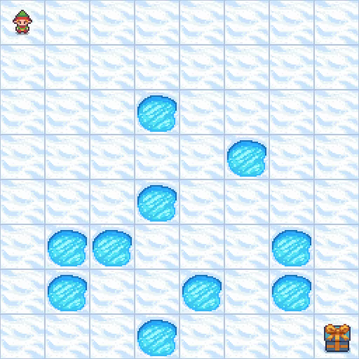
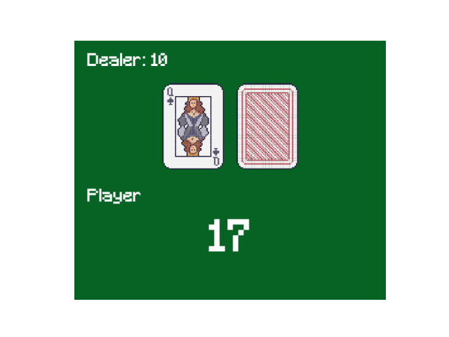
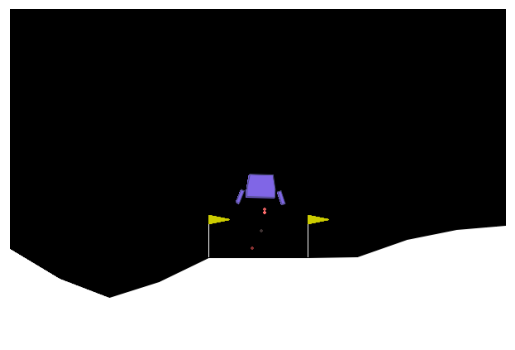

# RL Exercises

This repository contains three hands-on exercises to introduce to some of the fundamentals of Reinforcement Learning (RL). Each exercise builds on concepts of Markov Decision Processes (MDPs) to function approximation using neural networks.

1. **Frozen Lake**: Use the Bellman Equations to find the optimal policy to cross the frozen safely.

<p align="center"></p>

2. **Blackjack**: Implement a tabluar Q-Learning agent to learn how to play Blackjack against a dealer.

<p align="center"></p>

3. **Lunar Lander**: Train a Deep Q-Networks (DQN) for landing a rocket safely.

<p align="center"></p>

You'll find more information of the environments in each notebook. The solutions of the questions are found in the next cell after the exercise. You'll need to double click to see the answer.


## Installation

To install the dependencies, run the following command:

```bash
pip install -r requirements.txt
```

If using Conda, you can also create an environment with the requirements:

```bash
conda env create -f environment.yml
```